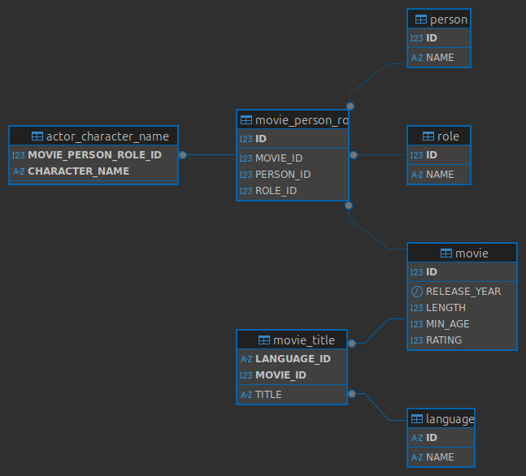

# База данных фильмов

## Описание

Учебная база данных для хранения информации о фильмах и участниках кинопроизводства.

---

## Структура БД

| Таблица                  | Назначение                                |
|--------------------------|-------------------------------------------|
| **movie**                | Список фильмов                            |
| **person**               | Люди (актёры, режиссёры, продюсеры и др.) |
| **role**                 | Должности/роли в фильмах                  |
| **movie_person_role**    | Участие людей в фильмах с указанием роли  |
| **actor_character_name** | Имена персонажей, если человек — актёр    |
| **language**             | Языки                                     |
| **movie_title**          | Названия фильмов на разных языках         |

---

## Схема базы данных

На схеме показаны связи между сущностями:

- `movie_person_role` — связывает людей, фильмы и их роли (многие-ко-многим);
- `actor_character_name` хранит персонажей актёров, ссылаясь на конкретное участие (`movie_person_role`);
- таблица `role` позволяет гибко расширять список должностей без изменения структуры БД;
- `movie_title` и `language` обеспечивают хранение названий фильмов на разных языках.

---

## Установка

Выполните скрипты в последовательности:

1. `db_create.sql` - создание таблиц
2. `db_create_person_delete_director_and_actor.sql` - обновление структуры
3. `db_create_data.sql` - заполнение данными
4. `db_indices.sql` - добавление индексов таблицам с пояснениями
5. `db_select.sql` - запросы заданий 2 и 3 с EXPLAIN (для сравнения запросов до индексирования и после)
